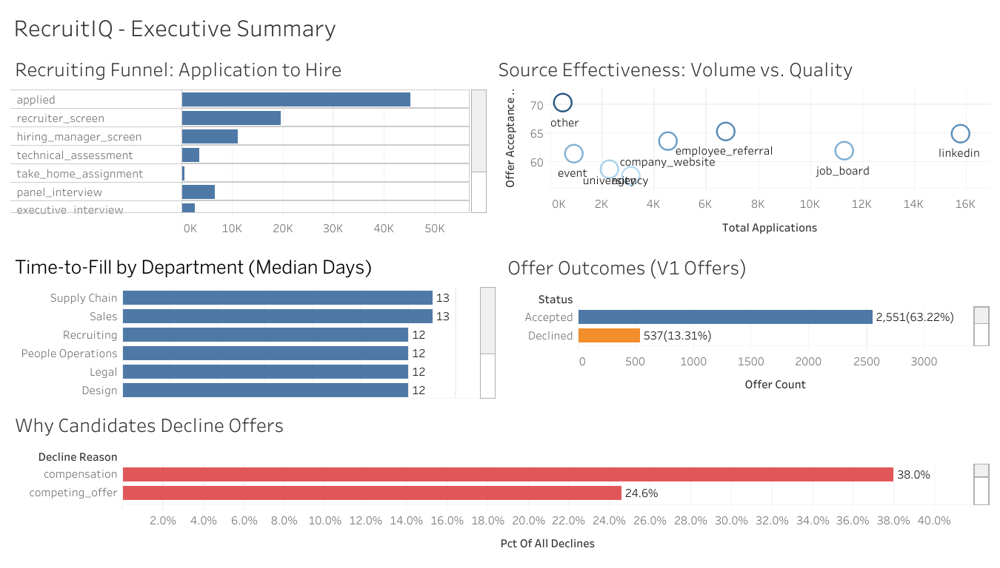

# RecruitIQ — Recruiting Pipeline Analytics

A full-stack analytics project that takes a synthetic recruiting dataset from raw CSVs through a normalized relational database, an automated data quality test suite running in CI, a SQL analysis layer answering operational HR questions, and an executive dashboard for non-technical stakeholders.

The project simulates the kind of work a People Analytics team does internally: building trustworthy data infrastructure first, then layering analysis and reporting on top of it.

**Live dashboard:** [Tab 1 — Executive Summary on Tableau Public](https://public.tableau.com/app/profile/hari4116/viz/RecruitIQ-RecruitingPipelineAnalytics/Tab1-ExecutiveSummary)



---

## What's in the dataset

185,069 rows across 5 tables, generated with Python and Faker, covering Jan 2023 – Oct 2025.

| Table | Rows | What it holds |
|---|---:|---|
| `job_requisitions` | 500 | Open and closed roles with department, location, hiring manager, recruiter, salary band, headcount, and status |
| `candidates` | 35,700 | Person records with contact info, demographics, education, and country |
| `applications` | 45,000 | Junction of candidate × requisition; carries source channel and status |
| `pipeline_stages` | 99,684 | Every stage transition for every application (applied → screen → … → hired) |
| `offers` | 4,085 | Offers with versioning for counter-offers, salary, response status, decline reason |

> Configured targets in `scripts/config.py` are 500 / 35,000 / 45,000 / ~110,000 / ~1,800. Actual row counts above reflect the latest generation run; pipeline stages and offers are derived during generation, so actuals diverge from the configured estimates.

**Headline numbers from the dataset:**

- 45,000 applications, 2,551 hires (5.67% overall conversion)
- Median time-to-fill: 12 days; p75: 30 days
- V1 offer acceptance rate: 63.22%
- Top decline reasons: compensation (38%), competing offers (25%), location (10%)
- Top sources by acceptance: employee referral (65.4%), LinkedIn (64.9%), company website (63.5%)

### Schema

```
job_requisitions ──< applications >── candidates
                          │
                          ├──< pipeline_stages
                          │
                          └──< offers
```

All foreign keys use `ON DELETE RESTRICT`. Source channel sits on `applications` rather than `candidates` because a candidate can apply to different roles through different channels. Hiring manager and recruiter names are stored as denormalized strings on `job_requisitions` rather than referencing a separate employees table — a deliberate scope decision documented in the schema file.

### Deliberately injected data quality issues

The generator scripts inject realistic data quality defects so the test suite has something real to catch. All injection rates are configurable in `scripts/config.py`:

| Defect | Rate | What it simulates |
|---|---:|---|
| Duplicate candidates with mutated emails | 2.0% | Same person enters the system twice through different application paths |
| Missing department on requisitions | 1.0% | Incomplete req intake forms |
| Pipeline stage dated before application | 0.5% | Backdating errors from manual data entry |
| Out-of-order pipeline stages | 1.0% | Stage progression broken by reorgs or manual edits |
| Orphan offers (non-active application) | 0.3% | Stale offer records after pipeline state change |
| Null hiring manager on requisition | 3.0% | Reqs opened before a hiring manager was assigned |

Each test that targets an injected defect uses imperative `pytest.xfail()` with count-bounded ranges. Unlike the `@pytest.mark.xfail` decorator, this approach lets unexpected escalations beyond the injected volume still fail the build — so a regression that causes 10x the expected duplicates surfaces immediately rather than getting silently absorbed.

---

## Repository layout

```
recruitiq/
├── .github/workflows/
│   └── data_quality_ci.yml          # GitHub Actions CI - runs full test suite on every push
├── sql/
│   ├── 01_schema.sql                # DDL for all 5 tables with FK constraints
│   └── analysis/
│       ├── 01_funnel_metrics.sql           # 5 queries: stage conversion, drop-off, time-in-stage
│       ├── 02_time_to_fill.sql             # 5 queries: TTF by department, seniority, quarter
│       ├── 03_source_effectiveness.sql     # 5 queries: source-to-hire rates, quality by source
│       ├── 04_offer_analytics.sql          # 6 queries: outcomes, decline reasons, comp analysis
│       ├── 05_recruiter_workload.sql       # 5 queries: load distribution, closure rates
│       └── 06_pipeline_diversity.sql       # 6 queries: education, geography, demographic lift
├── scripts/
│   ├── config.py                    # Volumes, date ranges, defect injection rates - single source of truth
│   ├── generate_job_requisitions.py
│   ├── generate_candidates.py
│   ├── generate_applications.py
│   ├── generate_pipeline_stages.py
│   ├── generate_offers.py
│   ├── export_to_csv.py             # Dump tables → CSV for Tableau
│   ├── export_analysis_to_csv.py    # Run all 32 analysis queries → CSV
│   └── test_db_connection.py
├── tests/data_quality/
│   ├── conftest.py                  # Session-scoped MySQL connection fixture
│   ├── test_referential_integrity.py
│   ├── test_temporal_consistency.py    # 8 tests
│   ├── test_completeness.py            # 9 tests
│   ├── test_uniqueness.py              # 7 tests
│   └── test_business_logic.py          # 8 tests
├── dashboard/
│   ├── recruitiq_executive_summary.twbx   # Tableau workbook (XML - see "Dashboard" section)
│   └── screenshot_tab1_executive_summary.png
├── pytest.ini
├── requirements.txt
└── .env.example
```

---

## Tech stack

| Layer | Tool |
|---|---|
| Database | MySQL 8.0 |
| Data generation | Python 3, Faker |
| Testing | pytest |
| CI/CD | GitHub Actions |
| Analysis | SQL |
| Dashboard | Tableau Public |
| Version control | Git, GitHub |

---

## Running it locally

You need MySQL 8.0 and Python 3.10+.

**1. Clone and set up the environment**

```bash
git clone https://github.com/harid0718/recruitiq.git
cd recruitiq
python -m venv venv
source venv/bin/activate          # on Windows: venv\Scripts\activate
pip install -r requirements.txt
```

**2. Configure database credentials**

```bash
cp .env.example .env
# edit .env to point at your local MySQL instance
```

**3. Create the schema**

```bash
mysql -u <user> -p recruitiq < sql/01_schema.sql
```

**4. Generate the dataset**

```bash
python scripts/generate_job_requisitions.py
python scripts/generate_candidates.py
python scripts/generate_applications.py
python scripts/generate_pipeline_stages.py
python scripts/generate_offers.py
```

Volumes and defect injection rates are controlled in `scripts/config.py`. Adjust there to scale the dataset up or down.

**5. Run the data quality tests**

```bash
pytest tests/data_quality/ --html=reports/dq_report.html
```

**6. Run the analysis queries and export for Tableau**

```bash
python scripts/export_to_csv.py              # Tables → data/processed/*.csv
python scripts/export_analysis_to_csv.py     # 32 query outputs → data/processed/analysis/*.csv
```

---

## Data quality test suite

Five categories of tests run against the live database. Each test queries MySQL directly and asserts a violation count.

| Category | Examples |
|---|---|
| **Referential integrity** | Every `applications.candidate_id` exists in `candidates`; no orphan pipeline stages |
| **Temporal consistency** | Pipeline stages occur after their parent application; offer responses come after offer creation |
| **Completeness** | Open requisitions have a department and a hiring manager; required fields are populated |
| **Uniqueness** | Candidate emails are unique after normalization; offer versions are sequential per application |
| **Business logic** | Offer salaries fall inside the requisition's salary band; offer seniority matches requisition seniority; filled requisitions have at least one hire |

Tests covering deliberately injected defects use imperative `pytest.xfail()` with count-bounded ranges. Unlike the `@pytest.mark.xfail` decorator, this approach lets unexpected escalations beyond the injected volume still fail the build — so a regression in the data pipeline that causes 5,000 duplicates instead of the expected 1,500 will surface immediately.

The full suite runs in CI on every push and pull request. Test results are uploaded as an HTML report artifact on each run.

---

## Dashboard

**Tab 1 — Executive Summary** ([live link](https://public.tableau.com/app/profile/hari4116/viz/RecruitIQ-RecruitingPipelineAnalytics/Tab1-ExecutiveSummary))

Five charts answering the questions an HR leader walks into a meeting wanting to know:

1. **Recruiting Funnel** — application-to-hire conversion at each pipeline stage
2. **Time-to-Fill by Department** — median days from req opened to hire, sorted slowest-first
3. **Source Effectiveness: Volume vs. Quality** — scatter plot positioning each sourcing channel by application volume against offer acceptance rate
4. **Offer Outcomes** — accepted, declined, expired, pending, rescinded breakdown of V1 offers
5. **Why Candidates Decline Offers** — decline reasons sorted by frequency, color-coded by whether they're addressable by HR

The decline-reason chart is the most actionable: 63% of declines cite compensation or competing offers, both of which are levers the recruiting org controls (salary benchmarking, faster offer cycles).

**On the workbook file in this repo:** the `.twbx` was downloaded from Tableau Public, which strips out embedded data. To open it locally with a working dashboard, regenerate the data using the scripts above, then re-point the data sources in Tableau to your local CSVs in `data/processed/analysis/`. The live Tableau Public link is the easiest way to view the dashboard.

---

## What I'd do next

Honest scope for what's missing and where the project would go with more time.

**Additional defect injection.** Two defect types planned but not yet implemented: offer salaries falling outside the requisition's configured salary band, and seniority level mismatches between the offer and the parent requisition. Test scaffolding is already in place in `tests/data_quality/test_business_logic.py`; the generators need a small extension to produce the injected violations. Adding both would push defect coverage closer to what a production ATS quality framework would catch.

**Statistical rigor.** The current analysis is descriptive — counts, percentages, medians. The next layer is inferential: regression to test whether source-to-hire rates differ significantly across channels after controlling for department and seniority; survival analysis on time-to-fill; A/B-style framing for "did the new referral bonus actually work" type questions. The dataset supports all of this — I just haven't built it yet.

**Tab 2 of the dashboard.** Five more charts already have SQL written and CSVs generated: recruiter workload distribution, time-to-fill trend by quarter, pipeline diversity by education and geography, compensation by seniority level, and counter-offer success analysis. The infrastructure is ready; the Tableau assembly is the remaining work.

**Real ATS integration.** The dataset is synthetic. Real recruiting data has weirdness Faker doesn't simulate — hiring managers who get reassigned mid-search, candidates who apply under different emails years apart, pipelines that get reset because of reorgs. Connecting to a real ATS API (Greenhouse, Lever, Workday) would be the next step in production.

**Incremental data testing.** The current CI regenerates the full dataset and runs the test suite. In a production environment with continuous ATS data ingestion, you'd want tests that run against incremental loads — checking new data quality without re-validating the entire history every time.

**Stakeholder-facing documentation.** A data dictionary in the repo (currently only inline in `01_schema.sql`), a methodology writeup for each metric (especially the time-to-fill calculation, which has subtle definitional choices), and a glossary of recruiting terminology for non-technical readers.

---

## Author

Built by [@harid0718](https://github.com/harid0718). Tableau dashboard published as [@hari4116](https://public.tableau.com/app/profile/hari4116).

LinkedIn: [@hari-dave2002](https://www.linkedin.com/in/hari-dave2002/)
